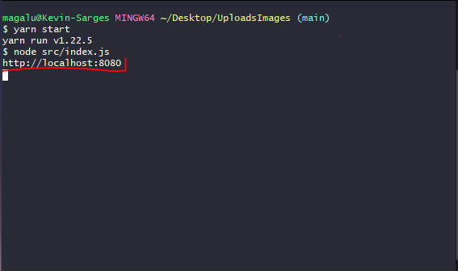
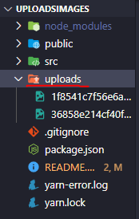
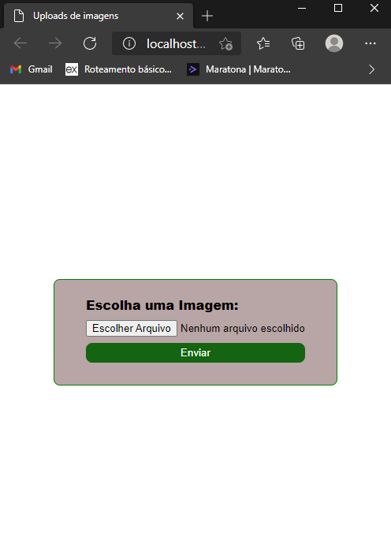
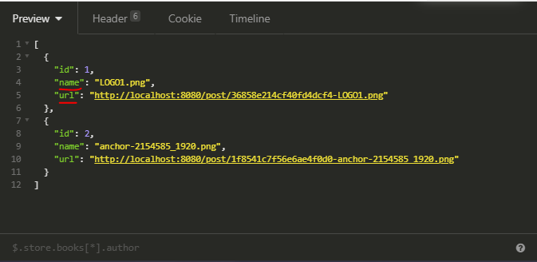
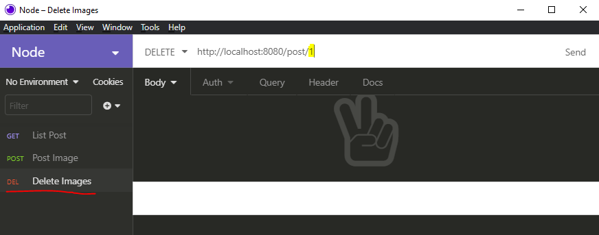

# Uploads Images

## Objetivo principal

API feita para quem deseja salva as imagens de seus projetos dentro do disco usando o Multer, SQLite e Node. 

## Observação

- Essa api é apenas para varsão de desenvolvedor, Não é muito bom usar a api da maneira que esta na versão de produção de uma aplicação. Pelo motivo de tesa salvando as imagens no disco, para poder usar em uma versão de produção as imagens deveriam ser salvas dentro de algum serviso de nuvem como a AWS da Amazen. Essa parte de configuração é feita no Multer, no caso você teria que mudar o local onde esta sendo salva as imagens dentro do arquivo multer.js na pasta controllers/Config (na documentação do ulter explica mais sobre essa mudança).
- A api não esta salvando a imagem dentrodo banco de dados, o que esta sendo salvo realmente é apenas dados como o nome, tamnho entre outros dados dependendo do que você vai querer salvar no banco de dados claro(No meu caso eu apenas usei o originalname e o filename), você pode ver mais informações na documentação do multer (https://github.com/expressjs/multer) ou pesquisar alguns outros exemplos no Google.

## Start API

Liga o servidor com `yarn` ou `npm` depois disso ele vai mostra uma mensagem mostrando a url.

```bash
npm run start ou yarn start
```



## Como Funciona a API

Atualmente a api esta salvando as imagens dentro de uma pasta chamada uploads (você pode altera o caminho se você desejar).



Você pode fazer o upload de uma imagem tanto pelo isomnia com uma rota POST quanto por uma pagina que eu criei para com HTML e CSS.



Os dados da imagem estão sendo salvas no banco de dados. Para visualizar os dados você pode usar o isomnia, com isomnia você pode testa as rotas que você criou usando os metodos GET, POST, DELETE e etc. Você cria uma nova requisição GET no isomnia com a rota http://localhost:8080/post que ira lista os dados que foram salvos no baco de dados.


A api esta salvando os dados que eu pedi no banco de dados como a url e o nome original da imagem. Você pode ver na pasta models no arquivo createTableImage.js.



Essa url não vem pronta eu tive que criar, voce pode ver no pages.js dentor da pasta controllers na função post.

para salvar as imagens a requisição tem que ser multipart/form-data assim com o enctype do form que crie.

Você também pode criar uma nova requisição de DELETE para deletar um dado do banco de dados pasando o id da imagem que foi sava no banco.



A requisição delete so vai deletar do banco de dados e nao da pasta uploads.

## Tecnologias usadas

- NodeJs
- Express
- Multer
- Crypto
- SQLite
- Hbs

## Informações adicionais

- Eu utilizei o Crypto para grear um nome diferente com caracteres diferentes para as imagens assim não vai dar conflito na hora de salvar os nomes das imagens no banco de dados. Com o crypto você pode gerar ids aleatorios para os seu banco de dados.

- O hbs é um templating engine para Node para paginas dinamicas.
